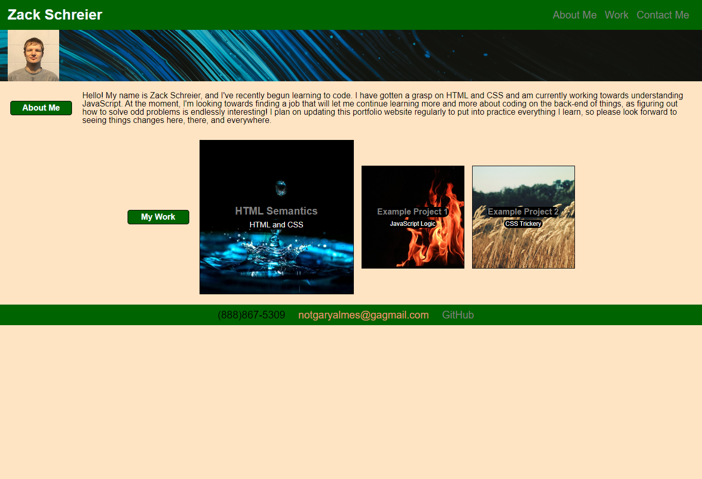

# **Module 2 Challenge:** Portfolio

## Description

The goal of this project was to create a portfolio webpage from scratch, using HTML and CSS. This project is expected to continue to grow and develop over time as more experience and expertise is gained.  

---

The project had extra focus on applying links to both sections of this webpage, as well as relevant external links. Styling options were applied in the CSS file to make these links noticeable. Additionally, it was requested that attention should be given to make sure the webpage renders cleanly on different size devices for accessibility.

## Preview
The webpage in its current state appears as such on larger screens:  

